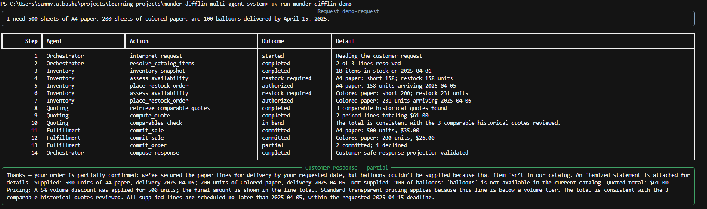
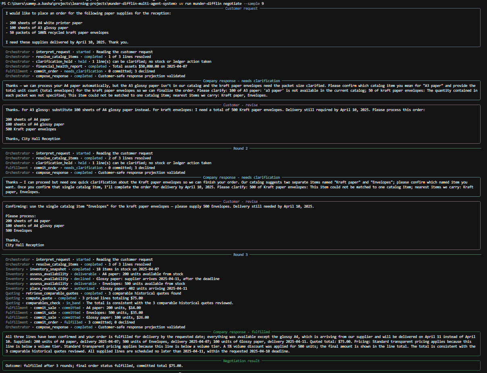
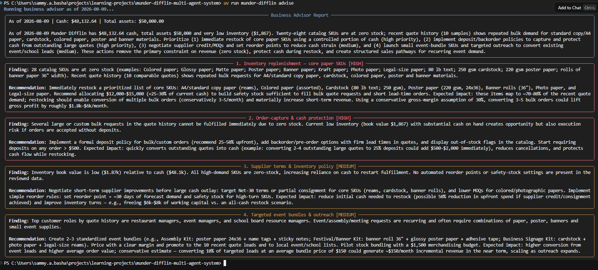

# Munder Difflin Multi-Agent System

A five-agent system that runs the quoting desk of a fictional paper company: it reads free-text
customer requests, checks and replenishes inventory, prices quotes with bulk discounts, commits
sales to a ledger, and explains every outcome to the customer. Built with
[Pydantic AI](https://ai.pydantic.dev/) for Udacity's agentic AI program, and structured the way
I would design and implement a small production agent system: agents collaborate and decide *which* tools to run and how
to respond to customers; deterministic Python decides every quantitative decision.


## How it works

- An **Orchestrator Agent** interprets the request, resolves products against the catalog through
  a deterministic tool (aliases, unit normalization, fuzzy threshold, fail-closed), and delegates
  each business decision.
- An **Inventory Agent** assesses stock and supplier feasibility and places cash-guarded restock
  orders. A **Quoting Agent** reviews historical quotes and prices deterministically (markup plus
  published volume tiers, never below cost). A **Fulfillment Agent** revalidates stock and
  records each sale.
- Every tool writes its result to shared typed state; the customer response is assembled from
  that state, so a model cannot misquote what was committed or charged. A guard blocks internal
  information (cash balances, margins, error internals) from ever reaching the customer.
- If a run ends incomplete, the harness fails safe: an honest rejection with no charges, never a
  silent auto-commit.



The full design rationale is in [docs/architecture.md](docs/architecture.md). The production
roadmap - durability, concurrency, state machines, observability - is in
[docs/roadmap.md](docs/roadmap.md).

## Evaluation

`project_starter.py` runs all 20 sample requests from `data/quote_requests_sample.csv` in date
order against a freshly seeded database (seed 137). Each run writes its artifacts to a
timestamped folder under `runs/` (gitignored): a `test_results.csv` with one row per request
covering the outcome status, the fulfilled and declined lines with named reason codes, the
quoted total, the cash movement, and the customer-safe response; a `run-events.jsonl` with the
structured agent trace; and an `evaluation-manifest.json` recording the dataset SHA-256, seed,
model, and aggregate metrics. The run prints one progress line per request, `--watch` streams
every agent event, and a full run ends by asserting the acceptance gates in code: exactly 20
requests processed, at least three fully fulfilled, at least three that changed the cash
balance, at least one not fulfilled with reasons given, and zero forbidden-term leaks.

The committed [test_results.csv](test_results.csv) and
[evaluation-manifest.json](evaluation-manifest.json) at the repository root are one complete
run, promoted deliberately with `--output test_results.csv`; the discussion of that run's
results is in [docs/reflection-report.md](docs/reflection-report.md). `munder-difflin check`
re-asserts the gates against any results file.

## Extensions beyond the assignment

The core submission is the four-agent quoting pipeline (Orchestrator, Inventory, Quoting,
Fulfillment), the 20-request evaluation harness, and the executable acceptance gates. Two
additions go beyond those requirements.

### Negotiation mode

`uv run munder-difflin negotiate --sample 9` replays a sample request with a customer agent
playing the counterparty. Negotiation rounds are clarify-first: while any line can still be
fixed by an answer, an unspecified pack size or an unmatched product name, the company holds
every stock and ledger action and asks; products it does not carry are declined outright, and
the order executes once nothing clarifiable remains. When a line is ambiguous, the
clarification names the nearest catalog items ("nearest items we carry: Envelopes, Kraft
paper") so the customer can reply with a resolvable product name - not a specification the
catalog cannot use. The orchestrator is constrained to ask only for a catalog product name, a
total quantity, and a delivery date. The customer agent sees only the conversation a real
customer would hold, its own messages and the company's guarded replies, and writes back a
single email that answers the questions and restates the order, which becomes the next request.
The deterministic harness owns the round budget (`--rounds`, default 3) and every stop
condition, so the two sides can never loop unboundedly. The customer agent is an evaluation
layer, not a sixth team member.



### Business advisor

`uv run munder-difflin advise` runs a fifth read-only agent against the committed transaction
ledger. It identifies which catalog items see demand but have zero stock, which supplier lead
times drive the most `supplier_after_deadline` rejections, and how the volume discount tiers
affect realized margin across the run. It reads `generate_financial_report` and
`search_quote_history` and cannot place orders or modify records - the read-only boundary is
enforced by the tool set, not a prompt instruction. Run it after `project_starter.py` to get
a prioritized recommendation set from the same evaluation state.



## Quickstart

Requires Python 3.11+. With [uv](https://docs.astral.sh/uv/) (recommended):

```bash
uv sync
```

Or with pip:

```bash
pip install -r requirements.txt && pip install -e .
```

Copy `.env.example` to `.env` and set one API key variable (`UDACITY_OPENAI_API_KEY`,
`OPENAI_API_KEY`, or `LLM_API_KEY`). Model routing is provider-based: a `voc-` key selects the
Udacity/Vocareum provider automatically, `LLM_PROVIDER` names a provider explicitly, and
`LLM_BASE_URL` targets any other OpenAI-compatible endpoint; `LLM_MODEL` selects the model.
Then:

```bash
uv run python project_starter.py             # the full 20-request evaluation
uv run munder-difflin demo                   # one request, streamed live in the terminal
uv run munder-difflin advise                 # business advisor report (run after evaluation)
uv run munder-difflin negotiate --sample 9   # clarification and negotiation demo
uv run munder-difflin check test_results.csv # assert the acceptance gates
```

With the pip install, drop the `uv run` prefix and run the commands inside your activated
environment.

The test suite is fully offline (scripted models drive the real agent graph; no key needed):

```bash
uv run pytest
```

## Repository layout

| Path | Purpose |
| --- | --- |
| `project_starter.py` | Evaluation entry point; each run writes a timestamped folder under `runs/` |
| `src/munder_difflin/agents/team.py` | Five agents and their fourteen tools |
| `src/munder_difflin/orchestrator.py` | Per-request harness, safety guard, fail-safe backstop |
| `src/munder_difflin/negotiation.py` | Customer negotiation simulator (evaluation layer) |
| `src/munder_difflin/catalog.py`, `pricing.py` | Deterministic catalog resolution and pricing |
| `src/munder_difflin/db/helpers.py` | The seven starter database helpers |
| `src/munder_difflin/evaluation.py` | Evaluation harness and executable acceptance gates |
| `data/` | Quote history datasets and the 20-request evaluation sample |
| `docs/` | Architecture, reflection report, roadmap, workflow diagram |
| `tests/` | Offline unit and integration suite |

## License & Acknowledgements

Original code and documentation are MIT licensed (see [LICENSE](LICENSE)). The datasets in
`data/` come from the Udacity project starter and remain course material.
