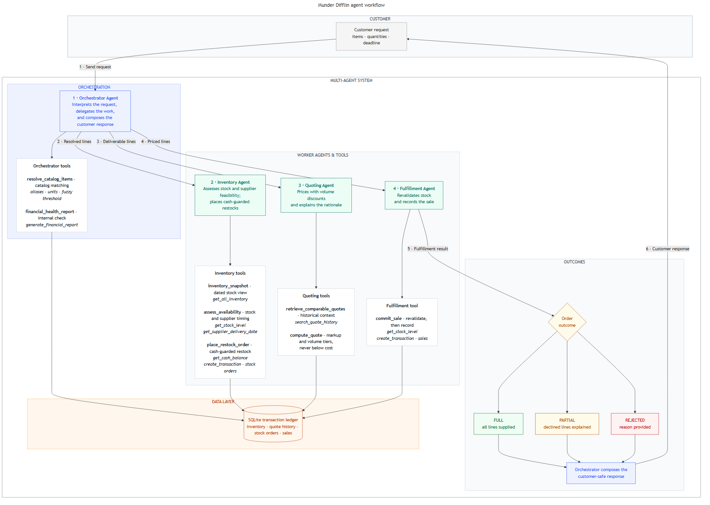

# Munder Difflin Multi-Agent System

A four-agent system that runs the quoting desk of a fictional paper company: it reads free-text
customer requests, checks and replenishes inventory, prices quotes with bulk discounts, commits
sales to a ledger, and explains every outcome to the customer. Built with
[Pydantic AI](https://ai.pydantic.dev/) for Udacity's agentic AI program, and structured the way
I would want a small production agent system reviewed: agents decide *which* tools to run and how
to word outcomes; deterministic Python decides every number.



## How it works

- An **Orchestrator Agent** interprets the request, resolves products against the catalog through
  a deterministic tool (aliases, unit normalization, fuzzy threshold, fail-closed), and delegates
  each business decision.
- An **Inventory Agent** assesses stock and supplier feasibility and places cash-guarded restock
  orders. A **Quoting Agent** reviews historical quotes and prices deterministically (markup plus
  published volume tiers, never below cost). A **Fulfillment Agent** revalidates stock and
  records each sale.
- Every tool writes its result to shared typed state; the customer response is assembled from
  that state, so a model cannot misquote what was committed or charged. A guard blocks internal
  information (cash balances, margins, error internals) from ever reaching the customer.
- If a run ends incomplete, the harness fails safe: an honest rejection with no charges, never a
  silent auto-commit.

The full design rationale is in [docs/architecture.md](docs/architecture.md), and deliberately
deferred features (business advisor agent, idempotent replay, negotiation simulator) are in
[docs/roadmap.md](docs/roadmap.md).

## Evaluation results

`python project_starter.py` runs all 20 sample requests in date order against a freshly seeded
database and writes [test_results.csv](test_results.csv); `munder-difflin check` asserts the
acceptance gates in code.

The committed run (gpt-5-mini through the Vocareum proxy, seed 137):

| Metric | Value |
| --- | --- |
| Requests processed | 20 |
| Fully fulfilled | 3 |
| Partially fulfilled | 14 |
| Rejected with reasons | 3 |
| Requests that changed the cash balance | 16 |
| Customer information leaks | 0 |
| Negative-inventory occurrences | 0 |

Every decline carries a named reason code (`unsupported`, `ambiguous`,
`supplier_after_deadline`, `stock_changed_before_commit`), no request needed the fail-safe
backstop, and the company's cash moved from $48,132.64 to $49,075.43 across the run. The
discussion of these results is in [docs/reflection-report.md](docs/reflection-report.md).

## Quickstart

Requires Python 3.11+. With [uv](https://docs.astral.sh/uv/) (recommended):

```bash
uv sync
```

Or with pip:

```bash
pip install -r requirements.txt && pip install -e .
```

Copy `.env.example` to `.env` and set one API key variable (`UDACITY_OPENAI_API_KEY`,
`OPENAI_API_KEY`, or `LLM_API_KEY`). Keys beginning with `voc-` are routed to the
Udacity/Vocareum proxy automatically. Then:

```bash
python project_starter.py                    # the full 20-request evaluation
uv run munder-difflin demo                   # one animated request in the terminal
uv run munder-difflin check test_results.csv # assert the acceptance gates
```

The test suite is fully offline (scripted models drive the real agent graph; no key needed):

```bash
uv run pytest
```

## Repository layout

| Path | Purpose |
| --- | --- |
| `project_starter.py` | Evaluation entry point; run it to reproduce `test_results.csv` |
| `src/munder_difflin/agents/team.py` | The four agents and their eleven tools |
| `src/munder_difflin/orchestrator.py` | Per-request harness, safety guard, fail-safe backstop |
| `src/munder_difflin/catalog.py`, `pricing.py` | Deterministic catalog resolution and pricing |
| `src/munder_difflin/db/helpers.py` | The seven starter database helpers |
| `src/munder_difflin/evaluation.py` | Evaluation harness and executable acceptance gates |
| `data/` | Quote history datasets and the 20-request evaluation sample |
| `docs/` | Architecture, reflection report, roadmap, workflow diagram |
| `tests/` | Offline unit and integration suite |

## Provenance

Original code and documentation are MIT licensed (see [LICENSE](LICENSE)). The datasets in
`data/` come from the Udacity project starter and remain course material.
